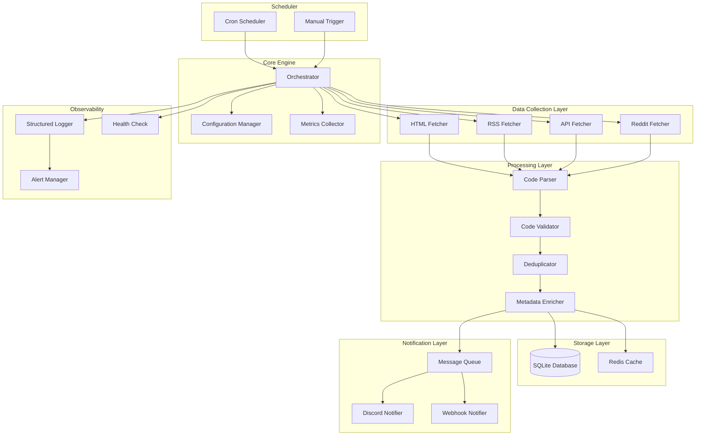

# Design Document

## Overview

The Shift Code Bot is a Python-based automated system that discovers, validates, and announces Borderlands Shift Codes to Discord communities. The system follows a modular architecture with clear separation of concerns between data collection, processing, storage, and notification components. The design emphasizes reliability, configurability, and maintainability while respecting source site policies and Discord rate limits.

## Architecture

### High-Level Architecture



### Component Architecture

The system is organized into distinct layers:

1. **Scheduler Layer**: Handles timing and triggering of bot executions
2. **Core Engine**: Orchestrates the entire pipeline and manages configuration
3. **Data Collection Layer**: Fetches content from various sources
4. **Processing Layer**: Parses, validates, and enriches code data
5. **Storage Layer**: Persists data and provides caching
6. **Notification Layer**: Handles message delivery with rate limiting
7. **Observability Layer**: Provides logging, metrics, and health monitoring

## Components and Interfaces

### 1. Configuration Manager

**Purpose**: Centralized configuration management with environment-based overrides and validation.

**Interface**:
```python
class ConfigManager:
    def load_config(self) -> Config
    def validate_config(self, config: Config) -> bool
    def get_sources(self) -> List[SourceConfig]
    def get_discord_channels(self) -> List[ChannelConfig]
    def reload_config(self) -> None
```

**Key Features**:
- Environment variable support with defaults
- Configuration validation on startup
- Hot-reload capability for source management
- Secrets management integration

### 2. Source Fetchers

**Purpose**: Modular fetchers for different source types with consistent interface.

**Base Interface**:
```python
class BaseFetcher:
    def fetch(self) -> Iterator[RawContent]
    def get_source_hash(self, url: str) -> str
    def should_skip_fetch(self, url: str, last_hash: str) -> bool
```

**Implementations**:
- `HtmlFetcher`: Web scraping with BeautifulSoup
- `RssFetcher`: RSS/Atom feed parsing
- `ApiFetcher`: REST API integration
- `RedditFetcher`: Reddit API integration via PRAW

**Features**:
- Content hashing for change detection
- Retry logic with exponential backoff
- Rate limiting and politeness controls
- Pagination support for historical backfill

### 3. Code Parser and Validator

**Purpose**: Extract and validate Shift Codes from raw content with high accuracy.

**Interface**:
```python
class CodeParser:
    def parse_codes(self, content: RawContent) -> List[ParsedCode]
    def extract_metadata(self, content: RawContent, code: str) -> CodeMetadata
    
class CodeValidator:
    def validate_format(self, code: str) -> ValidationResult
    def normalize_code(self, code: str) -> str
    def check_expiration(self, metadata: CodeMetadata) -> bool
```

**Features**:
- Multiple regex patterns for different code formats
- Context-aware metadata extraction (rewards, platforms, expiration)
- Fallback parsing strategies for resilience
- Expiration date parsing with timezone handling

### 4. Deduplication Engine

**Purpose**: Prevent duplicate announcements while handling metadata updates.

**Interface**:
```python
class DeduplicationEngine:
    def is_duplicate(self, code: str) -> bool
    def should_update_metadata(self, code: str, new_metadata: CodeMetadata) -> bool
    def mark_as_processed(self, code: str, metadata: CodeMetadata) -> None
```

**Features**:
- Canonical code normalization
- Metadata comparison for updates
- Source tracking for attribution
- Status management (new/announced/expired/updated)

### 5. Database Layer

**Purpose**: Persistent storage with optimized queries and data integrity.

**Schema Design**:
```sql
-- Core codes table
CREATE TABLE codes (
    id INTEGER PRIMARY KEY AUTOINCREMENT,
    code_canonical TEXT UNIQUE NOT NULL,
    code_display TEXT NOT NULL,
    reward_type TEXT,
    platforms TEXT, -- JSON array
    expires_at_utc TIMESTAMP,
    first_seen_at TIMESTAMP NOT NULL,
    last_updated_at TIMESTAMP NOT NULL,
    source_id INTEGER REFERENCES sources(id),
    status TEXT CHECK(status IN ('new', 'announced', 'expired', 'updated')) DEFAULT 'new',
    metadata TEXT -- JSON for extensibility
);

-- Sources configuration
CREATE TABLE sources (
    id INTEGER PRIMARY KEY AUTOINCREMENT,
    name TEXT NOT NULL,
    url TEXT NOT NULL,
    type TEXT CHECK(type IN ('html', 'rss', 'api', 'reddit')) NOT NULL,
    enabled BOOLEAN DEFAULT TRUE,
    parser_hints TEXT, -- JSON configuration
    last_crawl_at TIMESTAMP,
    last_content_hash TEXT,
    created_at TIMESTAMP DEFAULT CURRENT_TIMESTAMP
);

-- Announcement tracking
CREATE TABLE announcements (
    id INTEGER PRIMARY KEY AUTOINCREMENT,
    code_id INTEGER REFERENCES codes(id),
    channel_id TEXT NOT NULL,
    message_id TEXT,
    announced_at TIMESTAMP NOT NULL,
    update_of_announcement_id INTEGER REFERENCES announcements(id),
    status TEXT DEFAULT 'sent'
);
```

**Features**:
- Optimized indexes for common queries
- Foreign key constraints for data integrity
- JSON fields for flexible metadata storage
- Audit trail for announcements

### 6. Notification System

**Purpose**: Reliable message delivery with rate limiting and formatting.

**Interface**:
```python
class NotificationManager:
    def queue_announcement(self, code: ParsedCode, channels: List[str]) -> None
    def process_queue(self) -> None
    def send_reminder(self, code: ParsedCode, channels: List[str]) -> None
    
class DiscordNotifier:
    def send_message(self, channel_id: str, message: FormattedMessage) -> MessageResult
    def send_update(self, original_message_id: str, update: FormattedMessage) -> MessageResult
```

**Features**:
- Message queuing with priority handling
- Rate limit compliance with backoff
- Template-based message formatting
- Thread-based updates for metadata changes
- Expiration reminder scheduling

### 7. Observability Components

**Purpose**: Comprehensive monitoring, logging, and alerting.

**Components**:
- **Structured Logger**: JSON-formatted logs with correlation IDs
- **Metrics Collector**: Performance and business metrics
- **Health Check**: System health monitoring
- **Alert Manager**: Failure detection and notification

**Key Metrics**:
- Crawl success/failure rates per source
- Code discovery rate and trends
- Parse success rates and error types
- Notification delivery success rates
- System performance metrics (latency, memory usage)

## Data Models

### Core Data Structures

```python
@dataclass
class SourceConfig:
    id: int
    name: str
    url: str
    type: SourceType
    enabled: bool
    parser_hints: Dict[str, Any]
    rate_limit: RateLimit

@dataclass
class ParsedCode:
    code_canonical: str
    code_display: str
    reward_type: Optional[str]
    platforms: List[str]
    expires_at: Optional[datetime]
    source_id: int
    context: str
    confidence_score: float

@dataclass
class CodeMetadata:
    reward_type: Optional[str]
    platforms: List[str]
    expires_at: Optional[datetime]
    is_expiration_estimated: bool
    additional_info: Dict[str, Any]

@dataclass
class FormattedMessage:
    content: str
    embeds: List[Dict]
    components: List[Dict]
    template_vars: Dict[str, Any]
```

### Configuration Schema

```python
@dataclass
class Config:
    database_url: str
    sources: List[SourceConfig]
    discord_channels: List[ChannelConfig]
    notification_settings: NotificationSettings
    scheduler_config: SchedulerConfig
    observability_config: ObservabilityConfig
```

## Error Handling

### Error Categories and Strategies

1. **Transient Errors** (Network timeouts, rate limits)
   - Exponential backoff retry
   - Circuit breaker pattern
   - Graceful degradation

2. **Parse Errors** (HTML structure changes)
   - Fallback parsing strategies
   - Structured error reporting
   - Alert generation for manual review

3. **Data Errors** (Invalid codes, corrupted data)
   - Validation and sanitization
   - Error logging with context
   - Continue processing other items

4. **System Errors** (Database failures, disk space)
   - Fail-fast with clear error messages
   - Health check integration
   - Alert escalation

### Resilience Patterns

- **Retry with Backoff**: For transient failures
- **Circuit Breaker**: For cascading failure prevention
- **Bulkhead**: Isolate failures between components
- **Timeout**: Prevent hanging operations
- **Graceful Degradation**: Continue with reduced functionality

## Testing Strategy

### Test Pyramid Structure

1. **Unit Tests** (70% coverage target)
   - Code parsing and validation logic
   - Data transformation functions
   - Configuration validation
   - Individual component behavior

2. **Integration Tests** (20% coverage target)
   - Database operations
   - External API interactions (mocked)
   - End-to-end pipeline with test data
   - Configuration loading and validation

3. **End-to-End Tests** (10% coverage target)
   - Full system workflow with test sources
   - Discord notification delivery
   - Error handling scenarios
   - Performance benchmarks

### Test Data and Fixtures

- **Static HTML Fixtures**: Captured pages with known codes
- **Mock API Responses**: Predictable test data for APIs
- **Database Fixtures**: Known state for integration tests
- **Configuration Fixtures**: Various config scenarios

### Continuous Integration

- **Pre-commit Hooks**: Code formatting, linting, basic tests
- **Pull Request Pipeline**: Full test suite, coverage reporting
- **Deployment Pipeline**: Integration tests, smoke tests
- **Scheduled Tests**: End-to-end validation against live sources

## Performance Considerations

### Scalability Design

- **Concurrent Fetching**: Parallel source processing with rate limiting
- **Database Optimization**: Proper indexing and query optimization
- **Caching Strategy**: Redis for frequently accessed data
- **Message Queuing**: Asynchronous notification processing

### Resource Management

- **Connection Pooling**: Reuse HTTP connections and database connections
- **Memory Management**: Streaming processing for large datasets
- **Rate Limiting**: Respect external service limits
- **Cleanup Jobs**: Regular maintenance of old data

### Monitoring and Alerting

- **Performance Metrics**: Response times, throughput, error rates
- **Business Metrics**: Codes discovered, notifications sent
- **System Metrics**: CPU, memory, disk usage
- **Alert Thresholds**: Configurable limits with escalation

## Security Considerations

### Secrets Management

- Environment variable configuration
- No hardcoded credentials
- Secure storage for Discord tokens
- Rotation capability for API keys

### Input Validation

- Sanitize all external input
- Validate configuration parameters
- Prevent injection attacks
- Rate limiting for API endpoints

### Network Security

- HTTPS for all external communications
- Certificate validation
- Timeout configurations
- User-agent identification

## Deployment Architecture

### Environment Configuration

- **Development**: Local SQLite, mock notifications
- **Staging**: Production-like setup with test Discord channels
- **Production**: Full configuration with monitoring

### Infrastructure Requirements

- **Compute**: Single server or container instance
- **Storage**: SQLite database with backup strategy
- **Network**: Outbound HTTPS access
- **Monitoring**: Log aggregation and metrics collection

### Operational Procedures

- **Deployment**: Blue-green deployment with health checks
- **Backup**: Regular database backups with retention policy
- **Monitoring**: 24/7 monitoring with on-call procedures
- **Maintenance**: Regular updates and security patches